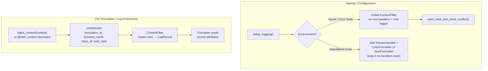

# DESIGN.md

Design Principles for `azure-functions-logging`

## Purpose

This document defines the architectural boundaries and design principles of the project.

## Design Goals

- Provide developer-friendly logging for Azure Functions Python v2 handlers.
- Inject invocation context (invocation_id, function_name, trace_id) into log records automatically.
- Detect cold starts without user intervention.
- Keep the standard `logging` module as the foundation — no new logging API to learn.
- Stay small enough to pair cleanly with `azure-functions-validation` and `azure-functions-openapi`.

## Non-Goals

This project does not aim to:

- Replace Python's standard logging module
- Provide distributed tracing or OpenTelemetry integration
- Manage log aggregation or external logging backends
- Modify the root logger's handlers or formatters
- Interfere with the Azure Functions worker's logging pipeline

## Design Principles

- **Principle 1**: The root logger's handlers and level are never modified. In Azure environments, only a `ContextFilter` is installed on existing handlers and the root logger (for future handler coverage).
- **Principle 2**: In Azure environments, behavior is safe by default — no forced colors, no excessive handler additions, no interference with the worker's `AsyncLoggingHandler`.
- **Principle 3**: Context injection failures never cause application failures. Logging helpers are auxiliary — they must never become a source of outages.
- **Principle 4**: The API surface stays as close to standard `logging` as possible. Users should not need to learn a new logging framework.

## Architecture

### Core Mechanism: `contextvars` + `logging.Filter`

The architecture uses Python's `contextvars` as the primary context propagation mechanism, with a `logging.Filter` that copies context variable values onto every `LogRecord`.



### Why `contextvars` + Filter (not `extra={}` per call)

1. **`extra` fields are lost over gRPC**: The Azure Functions worker's `AsyncLoggingHandler` sends the formatted message string via gRPC. Structured `extra` fields on the `LogRecord` do not survive the gRPC boundary.
2. **Filter covers all loggers**: A filter installed on a handler covers every logger that uses that handler, including third-party libraries. No need for callers to hold a bound logger reference.
3. **Immutability**: `contextvars` naturally scope to the current execution context. No mutable shared state that can leak between invocations.
4. **`__getattr__` delegation gap**: A wrapper that proxies methods via `__getattr__` misses context injection for delegated calls like `.log()`, `.exception()`. A Filter avoids this entirely.

### Module Structure

```
src/azure_functions_logging/
├── __init__.py          # Public API: setup_logging, get_logger, inject_context, JsonFormatter
├── _context.py          # contextvars, ContextFilter, inject_context, cold_start
├── _formatter.py        # ColorFormatter (local dev), context-aware formatting
├── _host_config.py      # host.json log level conflict detection (v0.2.0)
├── _json_formatter.py   # JsonFormatter for structured NDJSON output (v0.2.0)
├── _logger.py           # FunctionLogger wrapper with bind() convenience
└── _setup.py            # setup_logging(), environment detection
```

All internal modules use underscore prefix (`_module.py`) to signal private implementation.

## Public API

Four exports plus a logger class:

| Export | Type | Purpose |
| --- | --- | --- |
| `setup_logging()` | Function | Configure logging for the current environment |
| `get_logger(name)` | Function | Create a `FunctionLogger` instance |
| `inject_context(context)` | Function | Set invocation context from `func.Context` |
| `JsonFormatter` | Class | Structured JSON log formatter (v0.2.0) |
### FunctionLogger Methods

| Method | Purpose |
| --- | --- |
| `bind(**kwargs)` | Return new logger with additional bound context (immutable) |
| `clear_context()` | Clear bound context fields |
| Standard logging methods | `debug`, `info`, `warning`, `error`, `critical`, `exception` |

## Key Design Decisions

### Environment Detection

`FUNCTIONS_WORKER_RUNTIME` is present both in Azure and under local Core Tools. Detection uses:

- `FUNCTIONS_WORKER_RUNTIME` → "Functions environment" (Azure or local Core Tools)
- `WEBSITE_INSTANCE_ID` → "Azure hosted" (not present locally)
- Absence of both → "standalone local development"

`setup_logging()` adds a `StreamHandler` with `ColorFormatter` only in standalone local development when the target logger has no existing handlers. In Functions environments, it installs only the `ContextFilter` on existing root handlers and the root logger itself; when `functions_formatter` is passed, it also sets that formatter on each existing handler.

### Cold Start Detection

A module-level global flag, flipped once on first invocation:

```python
_cold_start = True

def _check_cold_start() -> bool:
    global _cold_start
    if _cold_start:
        _cold_start = False
        return True
    return False
```

This is set as a contextvar by `inject_context()` so formatters can include it.

### trace_id Extraction

Parsed from `context.trace_context.trace_parent` (W3C Trace Context format):

```
00-<trace_id>-<parent_id>-<flags>
```

Extraction is wrapped in try/except — failures are silently ignored per Principle 3.

### bind() Convenience Layer

`FunctionLogger.bind()` returns a new wrapper with merged context. The bound context is injected via `extra={}` on each log call and is additional to (not replacing) the contextvars-based context from the Filter.

```python
logger = get_logger(__name__)
bound = logger.bind(user_id="abc", operation="checkout")
bound.info("Processing")  # includes user_id + operation + invocation_id (from filter)
```

### Handler Safety in Azure

- `setup_logging()` does NOT add handlers in Azure / Core Tools environments
- `setup_logging()` does NOT modify root logger level (respects `host.json` intent)
- `setup_logging()` only installs `ContextFilter` on the root logger (safe — filters don't affect message routing)
- In standalone local dev, adds one `StreamHandler` with `ColorFormatter` to the package logger

## Integration Boundaries

- Invocation context belongs to `azure-functions-logging`
- Request/response validation belongs to `azure-functions-validation`
- OpenAPI generation belongs to `azure-functions-openapi`
- Project diagnostics belong to `azure-functions-doctor`

## Compatibility Policy

- Minimum supported Python version: `3.10`
- Supported runtime target: Azure Functions Python v2 programming model
- Public APIs follow semantic versioning expectations
- No runtime dependency on `azure-functions` (optional import only)

## Change Discipline

- Context injection semantics must be covered by regression tests
- Formatter output changes are user-facing behavior changes
- Experimental APIs must be clearly labeled in code and docs


## Sources

- [Azure Functions Python developer reference](https://learn.microsoft.com/en-us/azure/azure-functions/functions-reference-python)
- [Monitor Azure Functions](https://learn.microsoft.com/en-us/azure/azure-functions/functions-monitoring)
- [host.json logging configuration](https://learn.microsoft.com/en-us/azure/azure-functions/functions-host-json#logging)
- [Supported languages in Azure Functions](https://learn.microsoft.com/en-us/azure/azure-functions/supported-languages)

## See Also

- [azure-functions-validation — Architecture](https://github.com/yeongseon/azure-functions-validation) — Request/response validation pipeline
- [azure-functions-openapi — Architecture](https://github.com/yeongseon/azure-functions-openapi) — OpenAPI spec generation
- [azure-functions-doctor — Architecture](https://github.com/yeongseon/azure-functions-doctor) — Pre-deploy diagnostic CLI
- [azure-functions-scaffold — Architecture](https://github.com/yeongseon/azure-functions-scaffold) — Project scaffolding CLI
- [azure-functions-langgraph — Architecture](https://github.com/yeongseon/azure-functions-langgraph) — LangGraph agent deployment