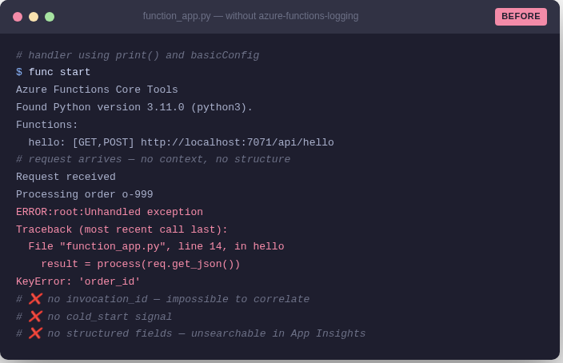
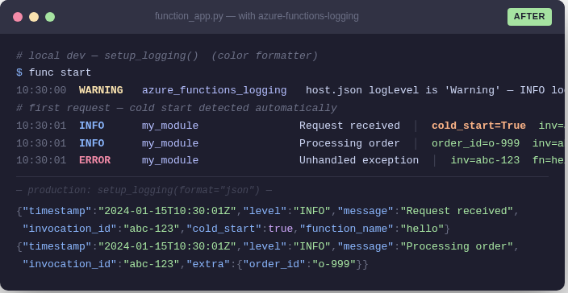

# azure-functions-logging

[](https://pypi.org/project/azure-functions-logging/)
[](https://pypi.org/project/azure-functions-logging/)
[](https://github.com/yeongseon/azure-functions-logging/actions/workflows/ci-test.yml)
[](https://github.com/yeongseon/azure-functions-logging/actions/workflows/release.yml)
[](https://github.com/yeongseon/azure-functions-logging/actions/workflows/security.yml)
[](https://codecov.io/gh/yeongseon/azure-functions-logging)
[](https://pre-commit.com/)
[](https://yeongseon.github.io/azure-functions-logging/)
[](LICENSE)

Read this in: [한국어](README.ko.md) | [日本語](README.ja.md) | [简体中文](README.zh-CN.md)

**Invocation-aware observability for Azure Functions Python v2.**  
Surfaces `invocation_id`, detects cold starts, warns on `host.json` misconfig, and outputs Application Insights-ready structured logs — without replacing Python's standard `logging`.

## Why This Exists

Azure Functions Python logging has specific failure modes that generic logging libraries don't address:

| Problem | What happens | This library |
|---------|-------------|--------------|
| `host.json` log level conflict | Your `INFO` logs silently disappear in Azure | Detects and warns at startup |
| No `invocation_id` in logs | Impossible to correlate logs to a specific execution | Auto-injects from `context` object |
| Cold start invisible | No signal when a new worker instance starts | Detects automatically on first `inject_context()` |
| Noisy third-party loggers | `azure-core`, `urllib3` flood your Application Insights | `SamplingFilter` / `RedactionFilter` |
| Local vs cloud output mismatch | Colorized output breaks in production pipelines | Environment-aware formatter switching |
| PII leaking into logs | Sensitive fields logged in exception tracebacks | `RedactionFilter` with pattern matching |

## Before / After

**Without** `azure-functions-logging` — plain `print()` output, no context, no structure:



**With** `azure-functions-logging` — colorized local dev output and production-ready JSON:



## Installation

```bash
pip install azure-functions-logging
```

## Quick Start

```python
import azure.functions as func
from azure_functions_logging import get_logger, inject_context, setup_logging

setup_logging()
logger = get_logger(__name__)

app = func.FunctionApp()

@app.route(route="hello")
def hello(req: func.HttpRequest, context: func.Context) -> func.HttpResponse:
    inject_context(context)  # binds invocation_id, function_name, cold_start

    logger.info("Request received")
    # {"level": "INFO", "invocation_id": "abc-123", "cold_start": true, ...}

    return func.HttpResponse("OK")
```

## Invocation Context

`inject_context(context)` should be the **first line** of every handler. It binds:

- `invocation_id` — unique per execution, correlates all logs for one request
- `function_name` — the Azure Functions function name
- `trace_id` — trace context from the platform
- `cold_start` — `True` on first invocation of this worker process

```python
def my_function(req, context):
    inject_context(context)
    logger.info("handler started")
    # every log from here carries invocation_id and cold_start
```

Without `inject_context()`, these fields are `None` in every log line.

## Structured JSON Output (Production)

Use JSON format when logs feed Application Insights or any aggregation system:

```python
setup_logging(format="json")
```

Output per log line (NDJSON — one JSON object per line):

```json
{"timestamp": "2024-01-15T10:30:00Z", "level": "INFO", "logger": "my_module",
 "message": "order accepted", "invocation_id": "abc-123", "function_name": "OrderHandler",
 "cold_start": false, "trace_id": "00-abc...", "extra": {"order_id": "o-999"}}
```

Extra fields appear in `extra` and are indexable in Application Insights:

```python
logger.info("order accepted", order_id="o-999", tenant_id="t-1")
```

## host.json Conflict Detection

If your `host.json` suppresses log levels that your app emits, you get this warning at startup:

```
WARNING: host.json logLevel.default is 'Warning'. Logs below WARNING will be suppressed in Azure.
```

Recommended `host.json` baseline:

```json
{
  "version": "2.0",
  "logging": {
    "logLevel": {
      "default": "Information",
      "Function": "Information"
    }
  }
}
```

## Noise Control

Suppress chatty third-party loggers without removing them:

```python
from azure_functions_logging import SamplingFilter, setup_logging
import logging

setup_logging()

# Only log 1 in 10 azure-core messages
logging.getLogger("azure").addFilter(SamplingFilter(rate=0.1))

# Silence urllib3 completely in production
logging.getLogger("urllib3").setLevel(logging.WARNING)
```

## PII Redaction

Strip sensitive fields before they reach Application Insights:

```python
from azure_functions_logging import RedactionFilter, setup_logging
import logging

setup_logging()
root = logging.getLogger()
root.addFilter(RedactionFilter(patterns=["password", "token", "secret"]))
```

Any log record where the message or extra fields match a pattern will have those values replaced with `[REDACTED]`.

## Local vs Cloud

| Environment | Format | Behavior |
|-------------|--------|---------|
| Local terminal | `color` (default) | Colorized `[TIME] [LEVEL] [LOGGER] message` |
| Azure / Core Tools | `json` | NDJSON, no ANSI codes, host-managed handlers |
| CI / pipeline | `json` | NDJSON, machine-parseable |

`setup_logging()` detects `FUNCTIONS_WORKER_RUNTIME` and `WEBSITE_INSTANCE_ID` to choose the right path automatically. In Azure, it installs context filters without adding handlers (avoids duplicate output from the host pipeline).

## Context Binding

Attach request-scoped metadata to every log without passing it through every call:

```python
def process_order(order_id: str) -> None:
    order_logger = logger.bind(order_id=order_id, region="eastus")
    order_logger.info("processing started")   # includes order_id + region
    order_logger.info("processing complete")  # same metadata, new message
```

Create bound loggers per-invocation. Do not cache them at module level.

## Documentation

- Full docs: [yeongseon.github.io/azure-functions-logging](https://yeongseon.github.io/azure-functions-logging/)
- [Configuration reference](https://yeongseon.github.io/azure-functions-logging/configuration/)
- [Troubleshooting guide](https://yeongseon.github.io/azure-functions-logging/troubleshooting/)
- [API reference](https://yeongseon.github.io/azure-functions-logging/api/)

## Ecosystem

- [azure-functions-doctor](https://github.com/yeongseon/azure-functions-doctor) — Pre-deploy health gate CLI
- [azure-functions-validation](https://github.com/yeongseon/azure-functions-validation) — Request and response validation
- [azure-functions-openapi](https://github.com/yeongseon/azure-functions-openapi) — OpenAPI and Swagger UI
- [azure-functions-scaffold](https://github.com/yeongseon/azure-functions-scaffold) — Project scaffolding
- [azure-functions-python-cookbook](https://github.com/yeongseon/azure-functions-python-cookbook) — Recipes and examples

## Disclaimer

This project is an independent community project and is not affiliated with,
endorsed by, or maintained by Microsoft.

Azure and Azure Functions are trademarks of Microsoft Corporation.

## License

MIT
