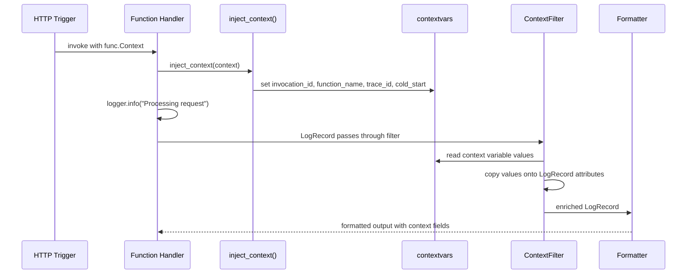
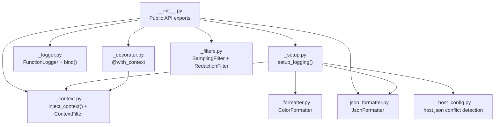

# Architecture

This document explains how `azure-functions-logging` is structured internally and why key design choices support Azure Functions production behavior.

## Design Objectives

The package is intentionally focused:

- Keep logging setup small for application developers.
- Preserve compatibility with Python standard `logging`.
- Add invocation-aware metadata without invasive patterns.
- Avoid duplicate handlers in runtime-managed environments.
- Stay dependency-light and operationally predictable.

## High-Level Components

Core modules and responsibilities:

- `__init__.py`: public exports and `get_logger()` factory.
- `_setup.py`: setup orchestration, environment detection, idempotency.
- `_logger.py`: `FunctionLogger` wrapper and immutable `bind()` behavior.
- `_context.py`: context variables, `inject_context()`, and `ContextFilter`.
- `_formatter.py`: local color formatter.
- `_json_formatter.py`: structured JSON formatter.
- `_host_config.py`: host policy mismatch warning logic.
- `_decorator.py`: `with_context` decorator for automatic context injection and cleanup.
- `_filters.py`: `SamplingFilter` (rate-limiting) and `RedactionFilter` (PII masking).

## Public API Boundary

Public symbols intentionally kept small:

- `setup_logging`
- `get_logger`
- `FunctionLogger`
- `JsonFormatter`
- `inject_context`
- `with_context`
- `RedactionFilter`
- `SamplingFilter`
- `__version__`
Everything else remains internal to keep migration and evolution manageable. (`__version__` is exported for programmatic version checks.)

## Setup Pipeline

`setup_logging()` is the entrypoint for configuration.

Behavior summary:

1. Validate input (`format` must be `color` or `json`).
2. Enforce idempotency (per `logger_name` — repeated calls are no-ops).
3. Build `ContextFilter`.
4. Detect runtime environment.
5. Apply local or runtime-safe setup strategy.
6. Check potential host-level log suppression mismatch.

## Environment Detection Strategy

Detection checks the `FUNCTIONS_WORKER_RUNTIME` environment variable to branch between local and runtime-safe paths:

- Present → Azure Functions / Core Tools runtime (host-managed handlers).
- Absent → local standalone Python (needs handler setup).

## Runtime-Safe Behavior in Azure/Core Tools

In Functions runtime contexts, setup avoids replacing host handler graph.

Instead, it:

- Installs `ContextFilter` onto existing root handlers.
- Installs filter on root logger for future handler coverage.
- Optionally sets `functions_formatter` on existing handlers when provided.
- Preserves host-managed output pipeline.

This prevents duplicate output and alignment issues with platform logging.

## Local Standalone Behavior

In non-Functions environments:

- Target logger level is set.
- `StreamHandler` is created only when the target logger has no existing handlers.
- Formatter is selected by `format` parameter when a new handler is created.
- `ContextFilter` is attached for metadata fields.

This gives deterministic local behavior with minimal code.

## Context Propagation Model

Invocation metadata is carried through `contextvars`:

- `invocation_id_var`
- `function_name_var`
- `trace_id_var`
- `cold_start_var`

Benefits of `contextvars`:

- Thread-safe isolation.
- Async task-safe isolation.
- No need to pass context objects through deep call stacks.

## Context Enrichment Flow

Request-level flow:

1. Handler calls `inject_context(context)` (or uses the `@with_context` decorator).
2. Context values are extracted and stored in context variables.
3. `ContextFilter` copies context variable values onto each `LogRecord`.
4. Formatter reads enriched `LogRecord` attributes and outputs the message.

This decouples business code from formatter implementation details.

## Cold Start Detection Design

Cold start is process-scoped and simple by design:

- Internal flag starts `True`.
- First `inject_context()` sets `cold_start=True`, then flips flag.
- Future calls in same process return `False`.

This model maps well to Azure Functions worker reuse semantics.

## FunctionLogger Wrapper Pattern

`FunctionLogger` wraps standard loggers rather than replacing logging internals.

Key properties:

- Full standard method familiarity (`info`, `warning`, `exception`, etc.).
- Immutable binding (`bind()` returns a new wrapper).
- Bound keys merged into per-record extra context.

Why wrapper over subclassing global logger:

- Less risky integration with existing libraries.
- Easier incremental adoption.
- Lower chance of side effects in framework code.

## Formatter Responsibilities

### Color Formatter

- Optimized for local human readability.
- Shows timestamp, level, logger, message.
- Includes context metadata when present.
- Appends traceback text for exceptions.

### JSON Formatter

- Outputs one JSON object per line.
- Captures core fields and context metadata.
- Preserves custom record fields under `extra`.
- Supports downstream indexing and analytics workflows.

## host.json Conflict Detection

Host-level settings can suppress app-level log events.

The warning helper:

- Reads `host.json` when present.
- Resolves host default level into logging equivalent.
- Warns if host policy is stricter than configured level.

This closes a common observability blind spot during setup.

## Error Handling Philosophy

The library prioritizes application continuity:

- Context extraction failures are silent and non-fatal.
- Missing context fields degrade to `None`.
- Setup validates format strictly and fails fast for invalid options.
- Host config parsing failures fail safe without crashing the app.

## Operational Implications

For production teams, this architecture means:

- You can adopt gradually without replacing logging foundations.
- Context correlation is easy with a single injection call.
- Local and runtime behavior differ intentionally to match platform constraints.
- Cold start analysis becomes available without custom plumbing.

## Key Design Decisions

### 1. Environment-driven setup strategy

`FUNCTIONS_WORKER_RUNTIME` is the branch variable that determines whether setup runs the Azure/Core Tools path or the local standalone path. `WEBSITE_INSTANCE_ID` is available as a helper signal but is not used in the primary branching logic.

### 2. Idempotent configuration per logger name

`setup_logging()` tracks configured logger names in an internal `_configured_loggers` set. Repeated calls for the same `logger_name` are no-ops. Different logger names each get their own setup pass.

### 3. contextvars for invocation metadata

Invocation-scoped metadata (`invocation_id`, `function_name`, `trace_id`, `cold_start`) is stored in `contextvars` rather than thread-locals or logger attributes. This provides automatic async-task isolation and avoids polluting the global logger namespace.

### 4. Wrapper over logger subclass

`FunctionLogger` wraps a standard `logging.Logger` instance rather than subclassing `logging.Logger` or replacing the logger class globally. This avoids side effects in third-party libraries and allows incremental adoption.

### 5. Process-scoped cold start flag

Cold start detection uses a module-level boolean that starts `True` and flips to `False` after the first `inject_context()` call. This maps directly to the Azure Functions worker process lifecycle without requiring external state.

### 6. Filter-based context enrichment

`ContextFilter` copies context variable values onto each `LogRecord` during the filter phase, before the formatter runs. This keeps the enrichment mechanism orthogonal to formatter choice — the same filter works with both `ColorFormatter` and `JsonFormatter`.

## Module Boundaries

## Related Documents

- [Usage Guide](usage.md)
- [Configuration](configuration.md)
- [API Reference](api.md)
- [Troubleshooting](troubleshooting.md)

## Sources

- [Azure Functions Python developer reference](https://learn.microsoft.com/en-us/azure/azure-functions/functions-reference-python)
- [Monitor Azure Functions](https://learn.microsoft.com/en-us/azure/azure-functions/functions-monitoring)
- [host.json logging configuration](https://learn.microsoft.com/en-us/azure/azure-functions/functions-host-json#logging)
- [Supported languages in Azure Functions](https://learn.microsoft.com/en-us/azure/azure-functions/supported-languages)

## See Also

- [azure-functions-validation — Architecture](https://github.com/yeongseon/azure-functions-validation) — Request/response validation pipeline
- [azure-functions-openapi — Architecture](https://github.com/yeongseon/azure-functions-openapi) — OpenAPI spec generation
- [azure-functions-doctor — Architecture](https://github.com/yeongseon/azure-functions-doctor) — Pre-deploy diagnostic CLI
- [azure-functions-scaffold — Architecture](https://github.com/yeongseon/azure-functions-scaffold) — Project scaffolding CLI
- [azure-functions-langgraph — Architecture](https://github.com/yeongseon/azure-functions-langgraph) — LangGraph agent deployment
